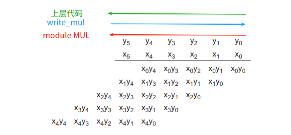

## develop logs

#### 2024-12-26
- 先理一下 v1，重点
  - power profile 弄进来
  - 【key】sequence agent 的设计（先后关系，能否 power profile 融入 hidden state）
  - 可以考虑现在的思路
  - 【key】global-individual reward 的设计
  - 再 design 理一下，先快速验证一下

Sequence Q
- idea v1
  - Q_L就两个，一个 mul 的一个 adder 的
  - 两个东西分别会有一个额外的隐藏层输入和一个隐藏层输出
  - 相当于两个智能体 ping pong，交替进行，拿对方的隐藏层输出作为自己输入一部分，自己也会产生一个隐藏层输出给对方。
  - 输出的隐藏层长宽和 image state一致，通道数暂时定为 1
  - 得到的方法其实就是 action head 和 type head 以外，再加一个Linear的head
  - 不确定的地方
    - 对于第一个 step，隐藏层怎么输入？0？random？**随机初始化**
    - 每一个子 step 都有一个reward，两个 agent执行完了有一个reward？[这个问题其实就是多智能体整体有reward，各自也有reward]
- idea v2
  - 原本的 sequence Q 是用来解决动作维度过高的问题的，但是我们的 Formulation 中其实维度就两个
  - 构建一个新的MDP
    - 状态空间：还是原来的 image state
    - 动作空间：$\mathbf{a} = \mathbf{a}^{1:M}\in\mathbb{R}^M$, $a_i$ 作为 $\mathbf{a}$ 的第 $i$ 分量，表示一次对结构的 Refine（就是原来的 action）。这样原来的 $Q$ 就成了现在的 $Q_L$ 的一个分量。**M给成固定的一个数**
    - 好处：
      - 一个动作是一个sequence，sequence rebuttal 时候验证了会有更好的效果
      - 这样相当于每步的 reward 就是 power - power_T，这会更和原始优化目标 min power 更 align 一些
      - 可以根据 domain knowledge 为 Q_L 每一小步加入 - num_22 之类的代理指标作为 reward（可能可以有点理论分析在里面，比如收敛性，e.t.c.）

  - 准备实现的一些细节
    - Q_U 是一个MLP，输入是 image state 展开为1维后和 a_1, a_2... 拼接起来的 2N * max_stage_num + M 维度向量，输出是一个一维向量，表示动作状态值
    - Q_L 是 N 个独立的 Q 函数，输入是状态和之前的动作的拼接，输出是各个动作上的 q value 值。（这里是文章里面自己说的 Q_L 独立会更稳定）
      - 或者可以有一个共用的encoder，encoder是一个 LSTM 的结构？这样的话每个 Q_L 的大小就不用变。
  - 可以考虑共用encoder，两个decoder, decode有顺序关系（先mul再add）
- idea v3【最开始的想法】
  - 每一列是一个维度，但是维度会爆炸
#### 2024-11-28

原来的 action 中，去除一个节点后重新做legalization会又把这个点弥补上，没有任何用

正确的做法是去除掉整个子树。

因为添加一个node的时候，其实就会创建整个子树

#### 2024-11-25

prefix tree optimize

参考 GOMIL 对前缀树优化

#### 2024-11-13
TODOs
搭建和 adder 相关的 rtl 级框架
- adder的代码生成
- adder的功耗信息读取

#### 2024-11-8
TODOs
1. 所有的 compressor 实现方式都做一下测试，包括 FA_1 和 HA_LUT
2. 各种实现方式的比例（出现概率）可能有影响【可以试试】
3. 连线和选型同时随机（信号的传播影响很大）
4. 【后面在做】UFO-MAC compressor assignment（也可能影响信号传播）

【其他的实现方式是否具有正收益】

motivation 实验
- step 1 引入其他实现方式 + 出现概率的影响（TODO 1 + 2）
  - 一些说明
    - 针对 dadda, 搜到最好的结构两种结构，16 bit/ 32 bit， and/booth 一共8个结构：
    - 需要在整个采样过程中固定概率。（因为会影响整体的比例）
  - 步骤
    - [FA ： FA_LUT : FA_1] = [1 : 1 : 1]/[3 : 1 : 1]/[1 : 3 : 1]/[1 : 1 : 3]
    - [HA : HA_LUT] = [1 ： 1]/[1 : 2]/[2 : 1]
    - 一共 4 x 3 = 12 组，每组抽样 100 次，抽取的样本计算默认 routing 和 最优routing，对于搜到的最优的额外评估一次搜到的 routing，一共 100x12x3x4 + 100x12x2x4次综合
- step 2 联合测试routing+comap
  - 一些说明
    - 比较耗时，这个今天先只测 16 bit 的，一共 4 个结构
    - 可能routing和comap存在耦合，需要看的是  【1】整体的分布 【2】各自的效用 【3】是否存在较强的关联性（因为可能comap本身影响不大，但是comap影响routing，但是routing影响很大）
  - 步骤
    - 固定几种 FA/HA 等概率出现
    - 随机生成 100 个routing方式和 100 个comap方式
    - 两两组合得到 10000 个乘法器设计
    - 每个 comap 额外计算一次最优 routing 和默认 routing，所以其实是每个结构 102x100 次综合仿真
    - 使用双因素方差分析，看看两个因素对结果的影响是否耦合（这个是问的GPT，之前已经发现routing 和comap都很正态，因此也可以考虑协方差）
    - 然后 hist 这10000个乘法器的power的分布


###### 双因素方差分析（Two-Way ANOVA）:

总均值
$$
\bar{F} = \frac{1}{N} \sum_{i=1}^a \sum_{j=1}^b F_{ij}
$$

因素 X 的主效应平方和
$$
\text{SS}_X = \sum_{i=1}^a n_i \left( \bar{F}_{X_i \cdot} - \bar{F} \right)^2
$$

其中
$n_i$ 表示在 X 的第 i 水平下的观测数
$\bar{F}_{X_i \cdot} = \frac{1}{n_i} \sum_{j=1}^b F_{ij}$

因素 Y 的主效应平方和
$$
\text{SS}_Y = \sum_{j=1}^b n_j \left( \bar{F}_{\cdot Y_j} - \bar{F} \right)^2
$$

其中
$n_j$ 表示在 Y 的第 j 水平下的观测数
$\bar{F}_{\cdot Y_j} = \frac{1}{n_j} \sum_{i=1}^a F_{ij}$

$$
交互效应平方和
\text{SS}_{\text{interaction}} = \sum_{i=1}^a \sum_{j=1}^b n_{ij} \left( \bar{F}_{X_i Y_j} - \bar{F}_{X_i \cdot} - \bar{F}_{\cdot Y_j} + \bar{F} \right)^2
$$

总平方和
$$
\text{SS}_{\text{total}} = \sum_{i=1}^a \sum_{j=1}^b \sum_{k=1}^{n_{ij}} \left( F_{ijk} - \bar{F} \right)^2
$$

各效应对总变异的相对贡献比例
$$
\text{Contribution}_{X} = \frac{\text{SS}_X}{\text{SS}_{\text{total}}} \times 100\%
$$

$$
\text{Contribution}_{Y} = \frac{\text{SS}_Y}{\text{SS}_{\text{total}}} \times 100\%
$$

$$
\text{Contribution}_{\text{interaction}} = \frac{\text{SS}_{\text{interaction}}}{\text{SS}_{\text{total}}} \times 100\%
$$

#### 2024-11-7
TODOs
- 时间太慢了，确认是哪里的问题
  - 可能是 log 的问题，设置 level
  - 后面先暂时在训练过程中取消routing，用成后处理
  - mask 直接存起来（不用每次都生成）
  - 测测时间
    - step: 4s 左右 没办法优化
    - update: 3.5s~4s -> 2.x s
    - log : 1s 左右 -> 0.01s 左右
    - 差不多从 9 s -> 6 s
  - low power adder 的使用
  - 试试根据 power mask 来替换 low power 的 adder
    - 现在的动作空间是原来的2倍多，可以试试小一点的 action space?比如就让 fa 能选择是 LUT or combination
    - 

一些在调试时的 assert 用 `$$DEBUG` 标出

#### 2024-11-6

- 将低功耗 FA/HA 实现加入动作空间
  - 起个名字：**comap**(Compressor map)
  - 怎么设计动作空间？
    - 现有的动作空间：
      - column action(pp column 个) + type action (4 个)
      - 现有动作只有针对 column 的，没有针对 stage 的。所以目前就先把**颗粒度局限在 column** 这个层级
    - **扩展动作空间**：
      - 假如现有的 FA 设计有 $F$ 个，HA 设计有 $H$ 个，那么就把 type action扩展为 $(4 + F + H)$ 个
      - 假如 type action $t$ 落在了 FA 域内： $4 \le t < 4 + F$ ，那么这个动作的含义是：“将这个column的FA全部替换为第 $t-4$ 号实现”。
  - 已有的低功耗压缩器实现（持续加入）
    - FA 有两个组合逻辑和一个LUT（一共 $3$ 个）
    - HA 有一个组合逻辑和一个LUT (一共 $2$ 个)
  - 某种意义上也算是比较高层级的 “**Technology mapping**”
  - 需要修改的地方
    - `o0_mul_utils.py`
    - `o0_rtl_tasks.py`
    - `o0_state.py`
      - 现有类基础上面改
      - 目前的 compressor_map 粒度是 slice，需要改为 column
      - mask 怎么办？
        - **认为当前列现有的种类为“不合法”动作**
        - **改变没有压缩器的列的种类为“不合法”动作**
      - **【TODO】** 原来的 mask 是从第二列开始的，现在的也是吗？（其实似乎影响不大？真不大吗？）
      - archive也要对应的改。
      - transition
    - `o1_environment_refine.py`
      - 貌似不需要改
    - `o2_policy_refine.py`
      - 改通道数量，继承现有类
    - `o3_trainer_refine.py`
      - 需要改改log
#### 2024-11-5
TODOs
- RND + power mask

#### 2024-11-4
TODOs
- 将power mask引入现有框架

#### 2024-10-30
TODOs
- `o0_state.py`
  - 将mask区分为 simple mask 和 mask_with_legality【√】
  - 新增 "archive"，将状态表示成 np.ndarray【√】
- `o1_environment_refine.py`
  - 新加 normalize 方式，拉回标准正态【√】
    - 正常的 reward 相当于只是改变权重的大小
    - long-term reward 改为 “初始的ppa - 当前的ppa”
  - 回调的传参全部以 dict 的形式
  - verilate: 验证当前状态
  - get_ppa_full_delay_cons
- `o2_policy_refine.py`
  - 这个文件中的类一方面是获取动作状态值的网络结构，一方面是选择动作的方式
  - net
    - DeepQPolicy
    - FactorDeepQPolicy
      - 优化 _combine 方式（参考类似于 meshgrid 的形式，提高运算速度）（反正量也不多，先不用管）
  - 选择动作的方式：改接口，mask应该作为参数在回调时传入 【√】
- `o3_trainer_refine.py`
  - mask 的获取方式改为从 env 中获取，而不是从 policy 中获取
  - 改接口
  - 新增 Power 可视化
  - 新增一个episode下 difference mask 可视化
- `o4_pipeline_refine.py`
  - 目前主要是为了调试用，加入上述这组文件即可，不需要动
- `o5_utils_refine.py`
  - 大修，主要是改回放池
- `verilate`
  - 新增 config.h 适配不同位宽的 mask
  - 尝试在 cmakelists 中自定义生成的模块的名称
- README.md 把《实现细节》改成 API reference

#### 2024-10-29
昨天的还没弄完

#### 2024-10-28
TODO:
- review baseline codes (发现之前的代码存在不少问题，需要单步测试确认)
- 搭建新环境
  - 新开一个文件 `o1_environment_refine.py`
    - 基类开发
      - reset
        - default: 使用初始设计 【√】
        - random：【√】
        - value...
      - scale 的方式添加 normal【√】
      - step 【√】
      - archive: 把当前的环境存起来【貌似不太需要】
      - verilate: 验证当前状态
- 搭建 verilator 验证环境
  - 等待昨天的 baseline 跑完
  - 依赖
    - flex 【√】
    - textxxx 【√】
    - xxx

- **问题**：发现即使通过除以 wallace 或 dadda 的 ppa 来 scale，还是存在 delay 变化幅度很大，而面积变化幅度很小的情况。
- **解决方案**：先离线随机生成一堆对应型号的乘法器，评估后找到各个 ppa 的均值和方差，然后减均值除方差。（把三个ppa拉回标准正态）

#### 2024-10-27
TODO HAVE baseline!
- 涉及到的文件/类
  - o5_utils.py
    - 仿真脚本需要添加 power【√】
    - Replay Memory 似乎不需要改（用的是`ReplayMemory`）【√】
  - o1_environment.py【√】
    - `SpeedUpRefineEnv`
      - 添加power
      - 添加初始化类型（多处）
      - reset！
  - o2_policy.py【√】
    - 似乎不需要改
  - o3_trainer.py【？】
    - update_env_initial_state_pool
    - step
    - log_stats
    - process_and_log_pareto
    - 太多了

#### 2024-10-26
完成 pp-routing v0 及 v1

完成 o0_rtl_tasks.py

#### 2024-10-25

添加README文件

添加 VERILATE 框架

## 实现细节



**baseline兼容开发**
- 现在的初始化方式包括  wallace 和 dadda，因此使用一个参数来说明初始化的类型

**文件说明**

- **`o0_mul_utils.py`**
  - 直接和乘法器底层关联的函数库
    - 生成 verilog: `write_mul`
    - 合法化: `legalize_compressor_tree`
    - 获取初始化压缩树: `get_compressor_tree` （目前只有 dadda 和 wallace）
    - 获取初始部分积: `get_initial_partial_product`
    - 各种综合、仿真脚本的模板和 verilog 源码模板

- **`o0_rtl_tasks.py`**
  - 可以视为仿真器，用于对生成的Verilog进行评估。多进程并行出现在这一文件
    - `EvaluateWorker`
      - 用于仿真 ppa、activity、power mask 的类
      - 首先创建一个类，然后使用 evaluate 方法，所有的仿真信息会保存在 self.results中
      - 使用 consult_xxx 方法可以获取仿真信息
    - `PowerSlewConsulter`
      - 用于获取 FA/HA 的功耗斜率信息
      - 会到 db_path 下去读取保存的 json 文件，没有的话才会去仿真；也可以手动指定仿真
      - 使用consult_power_slew方法可以获取一个 slice 上所有port的功耗斜率信息

- **`o0_state.py`**
  - 乘法器状态文件，主要专注于乘法器结构的数据结构，而不是底层物理实现
    - `State`
      - 乘法器类，重要成员变量包含
        - `self.ct` 压缩树
        - `self.cell_map` 前缀树 （待实现）
        - `self.compressor_map` 压缩树的压缩器种类映射
        - `self.pp_wiring` 部分积连线
      - 使用时，需要先创建一个类，然后使用 `init` 方法来获取初始状态（不写在 `__init__` 里面一方面是害怕被重载时出错，一方面是测试方便 ），然后使用 `emit_verilog` 方法输出 verilog 文件

- **`./verilate`**
  - 用于验证生成的 verilog 文件逻辑上的正确性
  - 需要安装 `verilator` 仿真器

- **`./o1_environment.py`**


- **`./o6_xxx`**
  - 这是一些比较重要的motivation实验的结果，仅能存在于各自的分支上
  - 这里是 `nmi_refine` 分支

**一些概念**
- `slice` 压缩树某一行某一列的所有压缩器（和UFO对齐）。
- `power slew` 功耗斜率。固定其余port的activity为0，这个端口上功耗和activity呈现的线性关系的斜率。
- `align/misalign` 在rtl层级，生成verilog会需要所有的底层信息；但是由于在状态层面粒度和底层不同，所以在交互时需要对齐粒度。这些函数通常以 align_xxx 命名

## PP Routing
#### **v0**

**`o0_state.State.pp_wiring_arrangement_v0`**

```python
def pp_wiring_arrangement_v0(self, verilog_path, build_dir, target_delay_list, n_processing, worker:EvaluateWorker=None) -> None:
    ...
```

worker 是仿真器实例，需要带有activity信息。如果输入为 None，就会自己创建一个 worker 实例来仿真并且返回。其余的参数就是用来仿真的，如果预先仿真了的话，这些参数给成None就行了。
